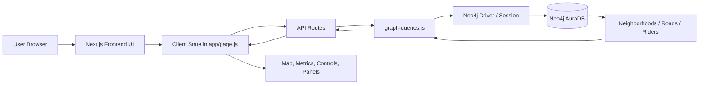
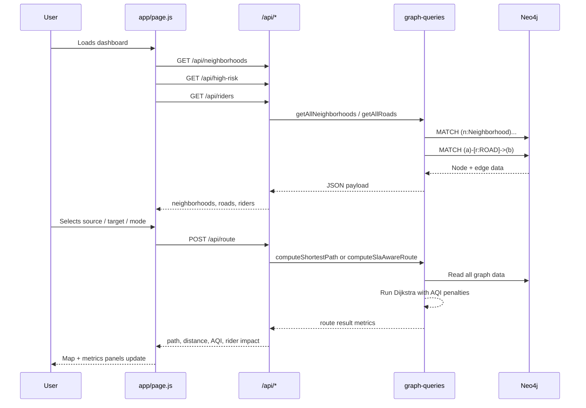
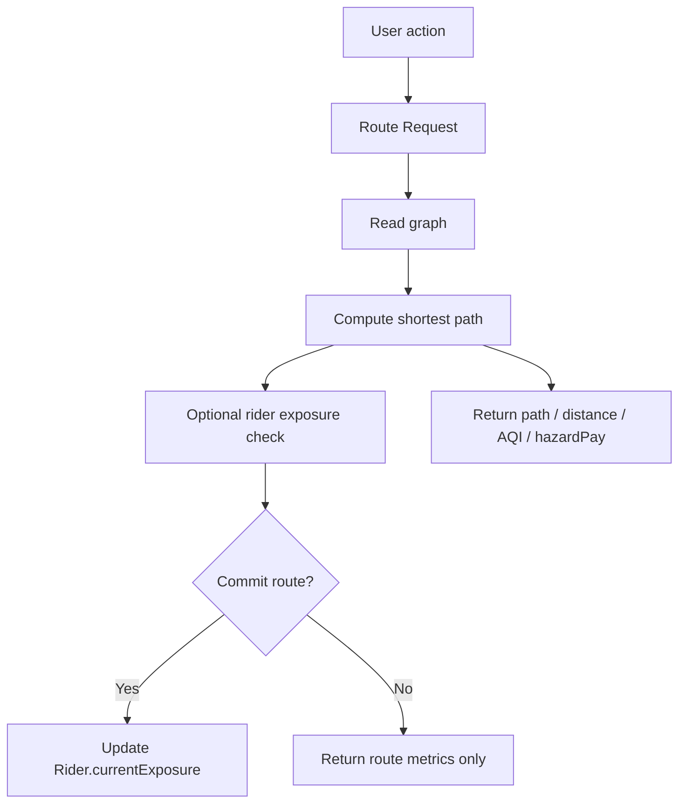
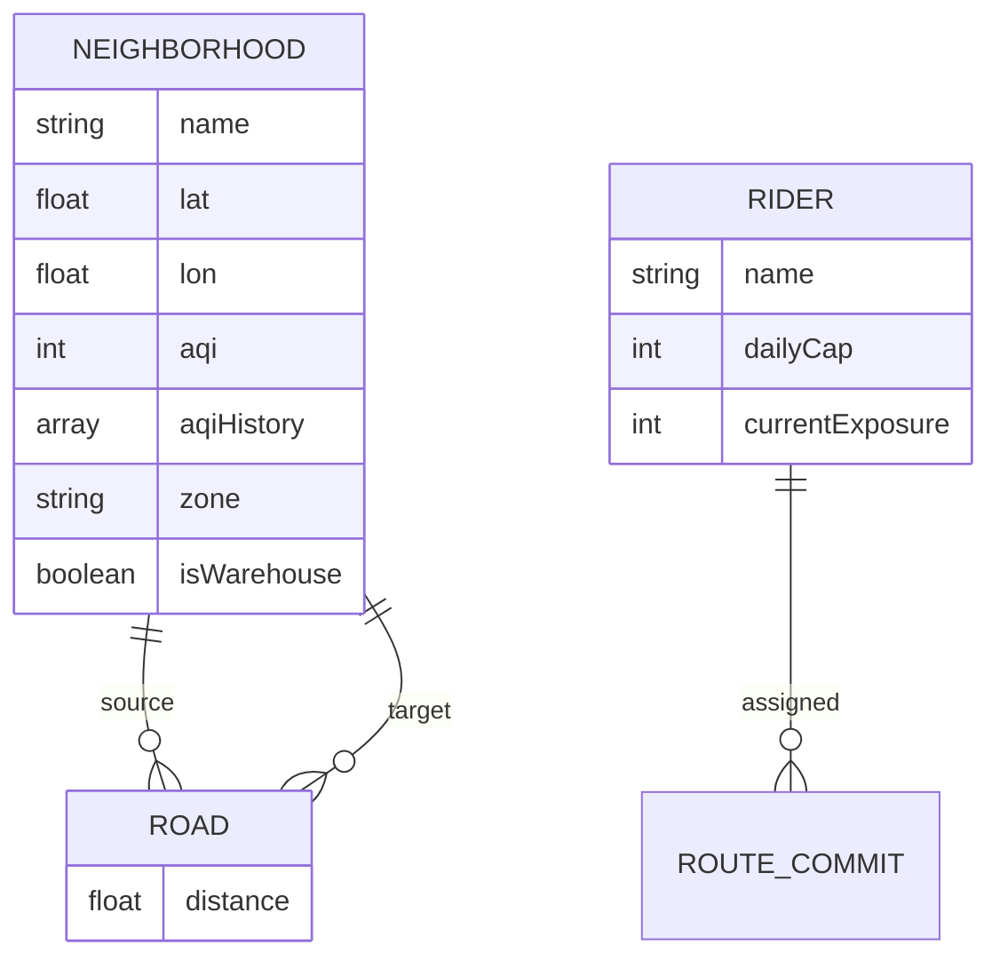
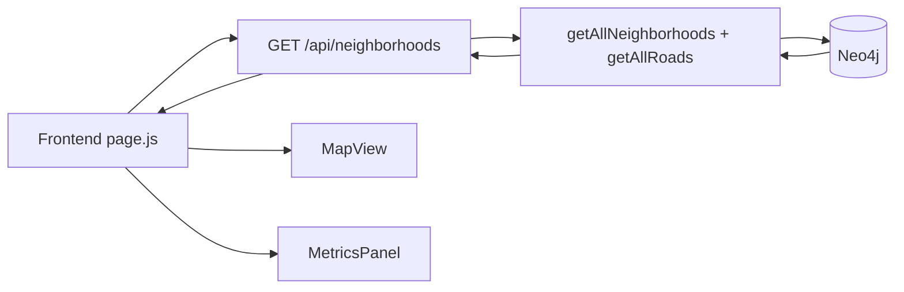
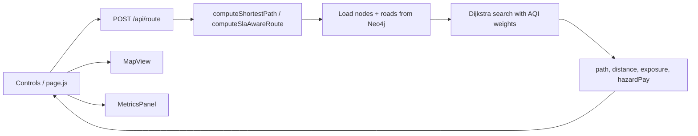
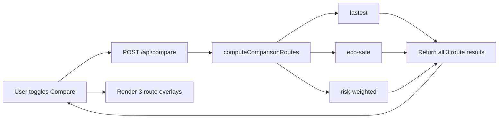
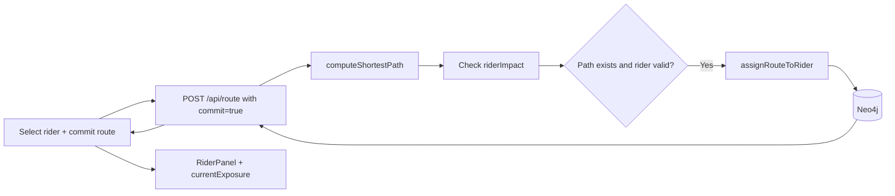

# EcoRoute Master Blueprint

## 1) Product Overview
EcoRoute is a Delhi NCR urban dispatch intelligence dashboard built with Next.js and Neo4j. The platform visualizes neighborhoods, AQI risk, and route planning decisions across multiple optimization modes. Users can:

- choose a warehouse origin and customer destination
- compare routing modes (`fastest`, `eco-safe`, `risk-weighted`)
- simulate AQI spikes across neighborhoods
- assign a route to a rider and monitor exposure caps
- view a live map and metrics panel for operational decision-making

The application is effectively a graph-based operations planner for eco-aware delivery routing.

---

## 2) Technology Stack

### Frontend
- Next.js App Router
- React client components
- Leaflet + React Leaflet for map rendering
- Tailwind-inspired utility styling with custom glassmorphism theme

### Backend / API Layer
- Next.js route handlers in `app/api/*/route.js`
- Graph logic centralized in `lib/graph-queries.js`
- Neo4j connection wrapper in `lib/neo4j.js`

### Database
- Neo4j AuraDB / Neo4j instance via `neo4j-driver`
- Graph model stores:
  - `Neighborhood` nodes
  - `Warehouse` labels on selected nodes
  - `Rider` nodes
  - `ROAD` relationships between neighborhoods

---

## 3) High-Level System Architecture



### Purpose of each layer
- `app/page.js`: orchestrator for all dashboard state and interactions
- `components/*`: UI surfaces for map, controls, metrics, riders, high-risk warnings
- `app/api/*/route.js`: request boundaries for route calculation, compare, neighborhood data, rider state, AQI spikes
- `lib/graph-queries.js`: graph logic and custom algorithms
- `lib/neo4j.js`: driver initialization and session creation
- `lib/seed-data.js`: graph seeding script to populate the database

---

## 4) Application Flow by User Journey

### Main dashboard lifecycle


---

## 5) Frontend Data Flow

### State ownership
`app/page.js` owns the application state for:
- `neighborhoods`
- `roads`
- `highRiskNodes`
- `riders`
- `source`, `target`, `mode`, `alpha`
- `currentRoute`
- `compareMode`, `comparisonResult`
- loading states and toasts

This makes the page the central orchestrator of all UI actions.

### UI component responsibilities
- `Controls.js`: source/target selection, route mode selector, alpha slider, compare toggle, rider selection, commit button
- `MapView.js`: Leaflet map display with real route geometry, AQI markers, compare overlays
- `MetricsPanel.js`: route KPIs such as distance, AQI exposure, hazard pay, SLA outcomes
- `HighRiskPanel.js`: hazardous neighborhoods above AQI 400
- `RiderPanel.js`: rider exposure, daily caps, reset actions
- `Sparkline.js`: AQI history display

---

## 6) Route Calculation Logic

### Routing modes
The core algorithm is implemented in `computeShortestPath()` and uses Dijkstra’s algorithm over a graph built from Neo4j road relationships.

#### 1. `fastest`
- minimize total physical distance
- edge cost = distance

#### 2. `eco-safe`
- excludes hazardous nodes with AQI > 400 (except source/target)
- if no safe path exists, returns a failure reason

#### 3. `risk-weighted`
- edge cost = distance + alpha * average AQI penalty
- formula in code:
  - `avgAqi = (aqi(u) + aqi(v)) / 2`
  - `aqiPenalty = (alpha * avgAqi) / 100`
  - `edgeWeight = distance + aqiPenalty`

### SLA-aware route logic
`computeSlaAwareRoute()` can reduce `alpha` iteratively until the route meets a target delivery time threshold. This is a fallback optimization layer for risk-weighted routing under a delivery SLA.

---

## 7) Data Flow to the Database

### What is stored in Neo4j

#### Neighborhood graph
Each neighborhood is a node with fields such as:
- `name`
- `lat`
- `lon`
- `aqi`
- `aqiHistory`
- `zone`
- `isWarehouse`
- label: `Neighborhood`
- label: `Warehouse` (if applicable)

#### Road graph
Each road is a relationship:
- `(a:Neighborhood)-[:ROAD { distance: ... }]->(b:Neighborhood)`

#### Rider graph
Each rider is a node:
- `name`
- `dailyCap`
- `currentExposure`
- label: `Rider`

### What gets written to DB
The app writes the following:

1. Initial graph seed data into `Neighborhood` and `ROAD` nodes/edges
2. AQI updates through `updateNodeAqi()`
3. Rider exposure increments via `assignRouteToRider()`
4. Rider resets via `resetRiderExposure()` / `resetAllRiders()`
5. Route planning output is not persisted as a separate route entity; instead route metrics are computed on demand from current graph state.



---

## 8) Neo4j Integration Blueprint

### Driver setup
`lib/neo4j.js` initializes the driver using environment variables:
- `NEO4J_URI`
- `NEO4J_USER`
- `NEO4J_PASSWORD`

It also includes a fallback to read `.env.local` for CLI usage when not running in the Next.js server runtime.

### Session pattern
All graph query functions follow a consistent lifecycle:
- `const session = getSession();`
- `session.run(...)`
- `finally { await session.close(); }`

This ensures connections are not leaked between requests.

### Core query patterns

#### Read neighborhood dataset
```cypher
MATCH (n:Neighborhood)
RETURN n.name AS name,
       n.lat AS lat,
       n.lon AS lon,
       n.aqi AS aqi,
       coalesce(n.aqiHistory, []) AS aqiHistory,
       n.zone AS zone,
       ('Warehouse' IN labels(n) OR n.isWarehouse = true) AS isWarehouse
ORDER BY n.name ASC
```

#### Read road edges
```cypher
MATCH (a:Neighborhood)-[r:ROAD]->(b:Neighborhood)
RETURN a.name AS source,
       b.name AS target,
       r.distance AS distance
```

#### Update AQI values
```cypher
MATCH (n:Neighborhood {name: $name})
SET n.aqi = $newAqi, n.aqiHistory = $newHistory
RETURN n.name AS name, n.aqi AS aqi, n.aqiHistory AS aqiHistory
```

#### Rider exposure update
```cypher
MATCH (r:Rider {name: $riderName})
SET r.currentExposure = coalesce(r.currentExposure, 0) + $amount
RETURN r.name AS name, r.dailyCap AS dailyCap, r.currentExposure AS currentExposure
```

---

## 9) Database Model Diagram



### Important design note
There is no explicit `Route` node persisted in the database. Instead, routes are calculated in memory from the current graph state and delivered as a response object. This is efficient for operations dashboards but means route history is not stored unless you add a `DispatchEvent` or `RouteRun` entity later.

---

## 10) Full Request/Response Blueprint

### Neighborhood load


### Route generation


### Compare mode


### AQI spike simulation
```mermaid
flowchart LR
    FE[Trigger spike event] --> API[POST /api/spike]
    API --> Q[getAllNeighborhoods]
    Q --> N[(Neo4j)]
    N --> Q
    Q --> SELECT[Pick random non-warehouse nodes]
    SELECT --> UPDATE[updateNodeAqi(name, newAqi)]
    UPDATE --> N
    N --> API
    API --> FE
    FE --> MAP[Marker colors update live]
```

### Rider assignment


---

## 11) Actual Dataset Model in This Repo
The data is not arbitrary; it is seeded to resemble a real Delhi NCR logistics and AQI network.

### Seeded geography
- 50 neighborhoods / nodes
- 5 warehouse hubs
- 45 customer-destination nodes
- 7 NCR satellite hubs / regional points

### Seeded relationships
The file `lib/seed-data.js` creates a dense arterial graph covering:
- Gurgaon Gateway connections
- West Delhi corridor
- North Delhi corridor
- Central Delhi ring
- South Delhi arterials
- East Delhi river transits
- Noida / Ghaziabad / Faridabad corridors

This dense graph ensures route generation always has realistic path choices.

---

## 12) What Goes to the Database
This project writes to Neo4j in these categories:

### A. Graph topology
- `Neighborhood` nodes
- `Warehouse` labels
- `ROAD` edges with distance

### B. Environmental state
- AQI values per neighborhood
- AQI history arrays (`aqiHistory`)
- hazard status derived from AQI > 400

### C. Rider operational state
- daily exposure cap per rider
- cumulative `currentExposure`
- reset actions for the day

### D. Derived calculation outputs
These are returned as JSON but not normally persisted as graph entities:
- shortest path
- distance
- hazard cost
- total AQI exposure
- SLA feasibility
- riderImpact metrics

### E. Seeding data only
- initial node graph and road network are created once during setup

---

## 13) Why this architecture works well
- Graph DB is ideal because routes are network problems, not table problems
- Neo4j makes pathfinding and relationship traversal natural
- Next.js route handlers provide a clean API boundary without exposing DB internals to the client
- The frontend remains highly reactive and state-driven for operations monitoring

---

## 14) Recommended Future Enhancements
1. Persist route history as `DispatchEvent` and `RouteRun` nodes
2. Add real time polling or WebSocket updates for AQI and rider exposure
3. Store route decision metadata for audit and accountability
4. Add user auth / role-based dispatch controls
5. Add map layers for wind direction, pollution dispersion, and traffic conditions
6. Add more realistic road travel times and congestion variables

---

## 15) Final Architecture Summary
EcoRoute is a graph-powered dispatch simulator where:
- the UI reads and displays graph data
- the API layer computes eco-aware routes
- Neo4j is the source of truth for neighborhoods, roads, AQI conditions, and rider exposure
- the frontend transforms graph outputs into operational decisions and visual overlays

In short, Neo4j stores the network state, while the app computes route choices on top of that state in real time.
