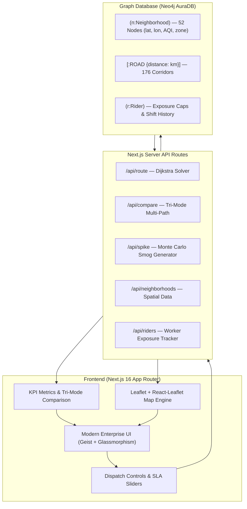

# 🌿 EcoRoute — Intelligent Clean-Air Dispatch & Dynamic Routing Engine

> **Urban logistics routing that balances delivery speed, rider health, and environmental exposure across Delhi NCR using Neo4j graph intelligence.**

[](https://nextjs.org/)
[](https://neo4j.com/)
[](https://leafletjs.com/)
[](https://tailwindcss.com/)

---

## 📌 Executive Summary

During severe winter smog episodes in metropolitan regions like Delhi NCR, delivery riders face extreme air pollution exposure (AQI often exceeds **400+ Hazardous**). Standard navigation engines strictly optimize for **distance or travel time**, forcing delivery fleets directly through toxic pollution hotspots and industrial smog corridors.

**EcoRoute** solves this with an enterprise-grade graph routing platform that dynamically balances delivery transit SLAs with rider AQI exposure, calculating optimal paths, hazard pay surcharges, and live dynamic rerouting during acute smog spikes.

---

## ⚡ Key Capabilities

| Feature | Description |
| :--- | :--- |
| 🗺️ **Multi-Objective Routing** | Instant computation and comparison across **Fastest (Distance)**, **Eco-Safe (Zero-Hazard AQI < 400)**, and **Risk-Weighted / Calibrated** algorithms. |
| ⚖️ **Calibrated $\alpha$-Tuning & SLA Constraints** | Operations dispatchers adjust the weight between speed vs. pollution penalty ($\alpha \in [0.1, 5.0]$) with strict max delivery time SLA ceilings. |
| 🌫️ **Live Smog Spike Simulation** | Simulate localized AQI emergencies in real-time; the system automatically evaluates alternate road corridors and recalculates active transit paths. |
| 🚴 **Rider Health & Exposure Tracking** | Real-time tracking of cumulative daily inhalation index against safety caps ($2,500\text{ AQI}\cdot\text{km}$) with OSHA-aligned hazard pay computation. |
| 📊 **Tri-Mode Comparison Engine** | Side-by-side multi-layer map rendering showing exact delta in kilometers, exposure index, travel time, and hazard compensation. |
| 🌐 **52-Node Delhi NCR Network Mesh** | 5 regional fulfillment centers, 47 commercial/residential distribution hubs, and 176 bidirectional road corridors. |

---

## 📐 Mathematical Formulation & Routing Algorithms

### 1. Fastest Mode (Distance Optimized)
Optimizes strictly for the shortest geometric distance using Dijkstra's algorithm over the graph edge weights:
$$\text{Cost}(u, v) = \text{distance}_{u, v}$$

### 2. Eco-Safe Mode (Hard Safety Exclusion)
Enforces a hard filter excluding all nodes where $\text{AQI} \ge 400$ (Hazardous tier), guaranteeing zero transit through severe smog traps:
$$V_{\text{safe}} = \{ v \in V \mid \text{AQI}(v) < 400 \} \cup \{\text{Source}, \text{Target}\}$$

### 3. Risk-Weighted & SLA-Calibrated Mode
Defines edge cost as a convex combination of physical transit length and average node pollution:
$$\text{AvgAQI}_{u, v} = \frac{\text{AQI}(u) + \text{AQI}(v)}{2}$$
$$\text{Cost}(u, v) = \text{distance}_{u, v} + \left( \frac{\alpha \cdot \text{AvgAQI}_{u, v}}{100} \right)$$

When an SLA target $T_{\max}$ (minutes) is specified:
$$T_{\text{est}} = \frac{\text{Distance}(\text{km})}{25\text{ km/h}} \times 60$$
If $T_{\text{est}} > T_{\max}$, the algorithm dynamically lowers $\alpha$ via progressive relaxation to find the highest environmental protection achievable within the required time window.

### 4. Hazard Pay Model
$$\text{Hazard Pay} = \max\left(0, \frac{\text{Average Route AQI} - 200}{100}\right) \times \text{Distance}(\text{km}) \times ₹1.50$$

---

## 🏗️ Architecture & Technology Stack



---

## 🚀 Quick Start Guide

### Prerequisites
- **Node.js**: `v18.0.0` or higher
- **Neo4j AuraDB** instance (or local Neo4j instance)

### 1. Clone & Install Dependencies
```bash
git clone https://github.com/your-repo/ecoroute.git
cd EcoRoute/frontend/ecoroute
npm install
```

### 2. Environment Configuration
Create a `.env.local` file in `frontend/ecoroute/.env.local`:
```env
NEO4J_URI=neo4j+s://<your-instance-id>.databases.neo4j.io
NEO4J_USER=neo4j
NEO4J_PASSWORD=<your-neo4j-password>
```

### 3. Seed Graph Network
Populate Neo4j with the 52 Delhi NCR spatial nodes and 176 road corridors:
```bash
npm run seed
```

### 4. Launch Development Server
```bash
npm run dev
```
Open [http://localhost:3000](http://localhost:3000) in your browser.

---

## 📂 Project Structure

```
EcoRoute/
├── frontend/ecoroute/
│   ├── app/
│   │   ├── api/
│   │   │   ├── compare/route.js      # Tri-mode route evaluation endpoint
│   │   │   ├── high-risk/route.js    # Hazardous zones list (>400 AQI)
│   │   │   ├── neighborhoods/route.js # Graph node/edge spatial data
│   │   │   ├── riders/route.js       # Rider exposure & shift reset
│   │   │   ├── route/route.js        # Main Dijkstra route engine & commit
│   │   │   └── spike/route.js        # Live localized AQI smog spike generator
│   │   ├── globals.css               # Custom Tailwind theme & enterprise tokens
│   │   ├── layout.js                 # Root layout & Geist typography
│   │   └── page.js                   # Master dashboard orchestrator
│   ├── components/
│   │   ├── Controls.js               # Origin/Destination, Mode, Alpha & SLA controls
│   │   ├── HighRiskPanel.js          # Critical smog zone alerts & live badges
│   │   ├── MapView.js                # Reactive Leaflet map with polyline routing
│   │   ├── MetricsPanel.js           # Enterprise KPI cards & mode diff tables
│   │   ├── RiderPanel.js             # Inhalation exposure meters & safety caps
│   │   └── Sparkline.js              # AQI trend sparkline visualizations
│   └── lib/
│       ├── graph-queries.js          # Neo4j Cypher queries & routing math
│       ├── neo4j.js                  # Database connection pool manager
│       └── seed-data.js              # 52-node Delhi NCR spatial dataset
├── workflows/
│   ├── aqi-simulator.ts              # Automated cron smog simulation engine
│   └── README.md                     # Background workflow documentation
└── README.md                         # Master project documentation
```
